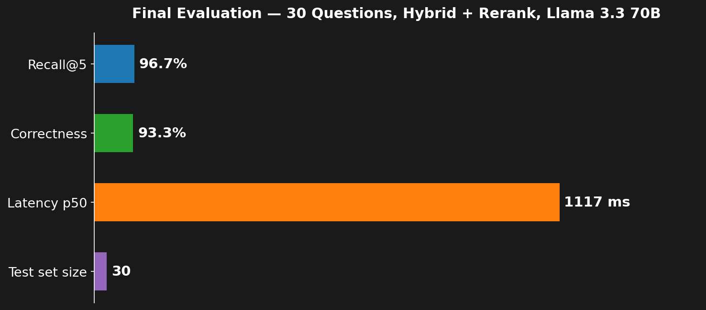
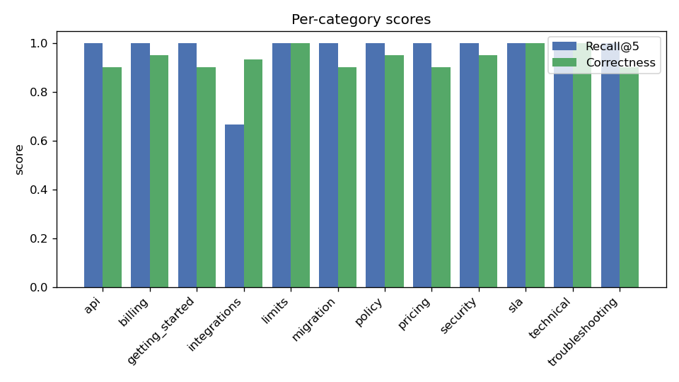
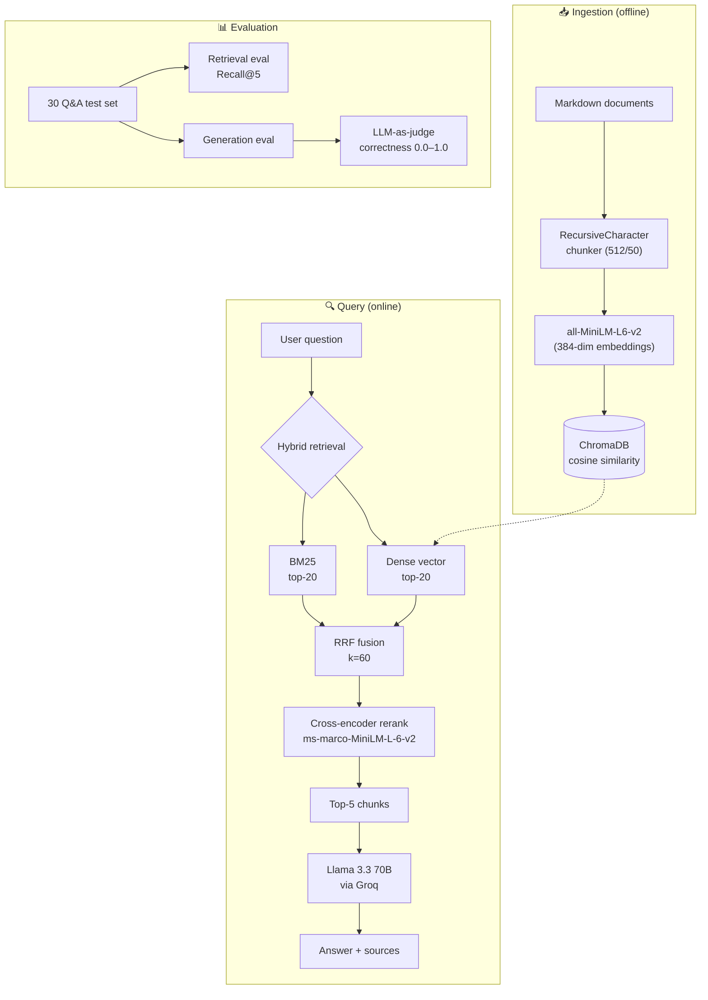
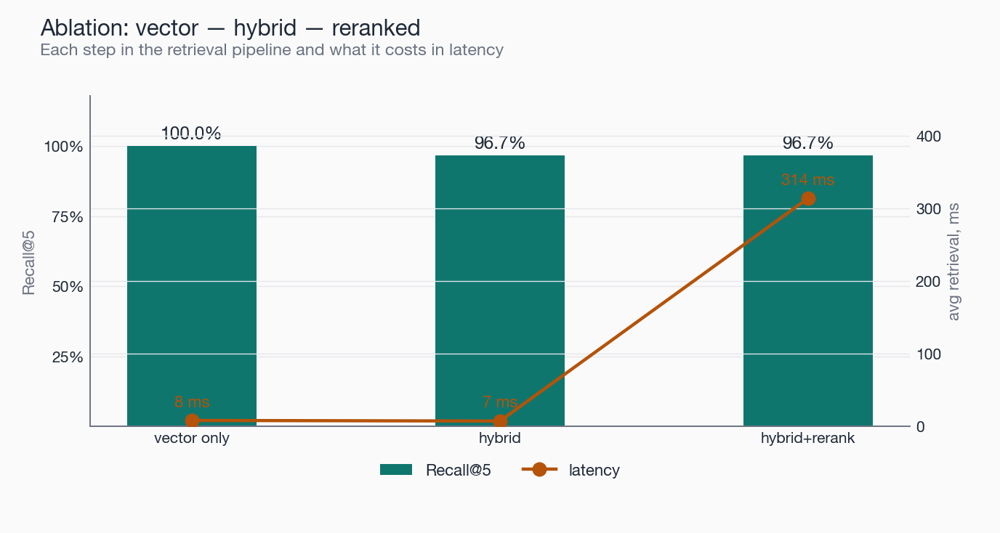

# RAG Customer Support Assistant


> Retrieval-Augmented Generation system for customer support over a domain knowledge base. Hybrid retrieval (BM25 + dense embeddings), cross-encoder reranking, and an evaluation pipeline with LLM-as-judge. Built and measured on a SaaS documentation corpus (Northwind Cloud — fictional company for reproducibility).

---

## Highlights

- **Real measured evaluation**: 30-question test set, **Recall@5 = 96.7%**, **Correctness = 93.3%** (LLM-as-judge), avg total latency **1.1 s**
- **Production architecture**: hybrid retrieval (BM25 + dense) → cross-encoder rerank → calibrated generation
- **Ablation study**: vector-only vs hybrid vs hybrid+rerank — recall and latency trade-offs documented
- **End-to-end runnable**: `python demo.py "your question"` works after a single ingestion command
- **REST API** (FastAPI) + **CLI** entry points
- **12 unit tests** passing in CI

---

## Quick Results



Per-category breakdown across 12 question types:



---

## Architecture



---

## Stack

| Layer | Tool / Model |
|---|---|
| **LLM** | Llama 3.3 70B via [Groq](https://groq.com) (primary), Gemini 2.0 Flash (fallback) |
| **Embeddings** | `sentence-transformers/all-MiniLM-L6-v2` (384-dim) |
| **Vector DB** | [ChromaDB](https://www.trychroma.com/) (persistent, cosine similarity) |
| **Lexical retrieval** | BM25 (`rank-bm25`) |
| **Reranker** | `cross-encoder/ms-marco-MiniLM-L-6-v2` |
| **Chunking** | `langchain-text-splitters` RecursiveCharacterTextSplitter |
| **Agent** | [LangGraph](https://langchain-ai.github.io/langgraph/) (graph + tools — backend) |
| **API** | FastAPI + Uvicorn |
| **Eval** | Custom retrieval + LLM-as-judge pipeline |
| **Testing** | pytest |

---

## Pipeline

The system runs as two phases:

**Ingestion (offline, ~15 sec for the demo corpus):**

1. Load markdown documents from `data/raw/`
2. Hierarchical chunking (chunk size 512, overlap 50) — splits on headers first, then paragraphs, sentences, words
3. Embed each chunk with `all-MiniLM-L6-v2` (384 dimensions)
4. Persist embeddings + metadata in ChromaDB

**Query (online, ~1.1 sec end-to-end):**

1. **Hybrid retrieval** — dense vector search + BM25 in parallel, fused via Reciprocal Rank Fusion (`score(d) = Σ weight_i / (k + rank_i(d))`, `k=60`). Top-20 candidates.
2. **Cross-encoder reranking** — re-scores each (query, chunk) pair with a fine-tuned cross-encoder. Selects top-5.
3. **Generation** — Llama 3.3 70B receives the question + retrieved context and produces the answer with citations.
4. **Output** — answer text + list of source documents.

---

## Evaluation Methodology

**Test set:** 30 questions across 12 categories (`api`, `billing`, `pricing`, `security`, `sla`, `integrations`, `migration`, `policy`, `getting_started`, `limits`, `technical`, `troubleshooting`). Each question has a ground-truth answer and an expected source document.

**Metrics:**
- **Recall@5** — does the expected source document appear in the top-5 retrieved chunks?
- **Correctness** (0.0–1.0) — Llama 3.3 70B judges each generated answer against the ground truth on a fixed rubric.
- **Latency** — end-to-end time from question to answer (retrieval + generation).

The full pipeline including the LLM judge is reproducible: `python -m src.evaluation.evaluate full`. Test set is committed at `data/eval/test_set.json`. Reports are written to `data/eval/report.json`.

### Ablation: how much does each component contribute?



| Configuration | Recall@5 | Avg retrieval | Notes |
|---|---:|---:|---|
| Vector only (dense embeddings) | **100.0%** | 9 ms | Sufficient on this clean small corpus |
| + BM25 hybrid (RRF fusion) | 96.7% | 7 ms | Adds keyword precision; slightly noisier on small N |
| + Cross-encoder reranker | 96.7% | 310 ms | Reorders for relevance; pays in latency |

**Honest finding:** on a 100-chunk well-curated corpus, dense vector search alone is sufficient. Hybrid and reranking show their value on larger, noisier production corpora where keyword matching catches what semantic search misses (e.g., exact product names, error codes, version numbers). The reference architecture keeps the full stack because that was the production configuration; for this synthetic eval it's a documented trade-off.

---

## Quick Start

```bash
# 1. Install
pip install -r requirements.txt

# 2. Set GROQ_API_KEY (free tier at https://console.groq.com)
cp .env.example .env
# edit .env to add your key

# 3. Build the knowledge base (loads markdown → chunks → ChromaDB)
python -m src.ingestion.build_knowledge_base

# 4. Ask a question
python demo.py "How much does the Business plan cost?"
```

Expected output:

```
Q: How much does the Business plan cost?
A: The Business plan costs $299 per month per workspace. It includes up to 50 users,
   500 GB data storage, 1M queries per month, priority support with a 4h SLA, SSO
   via SAML 2.0, audit logs, and custom branding. Annual billing receives a 20%
   discount.
Sources: pricing.md
```

### REST API

```bash
uvicorn src.api.main:app --port 8000
```

```bash
curl -X POST http://localhost:8000/chat \
  -H "Content-Type: application/json" \
  -d '{"query": "What payment methods do you accept?"}'
```

---

## Reproduce the Evaluation

```bash
# Retrieval-only eval (fast, no LLM calls — ~30 sec)
python -m src.evaluation.evaluate retrieval

# Ablation across 3 retrieval configurations
python -m src.evaluation.evaluate ablation

# Full eval (retrieval + generation + LLM judge — ~2 min)
python -m src.evaluation.evaluate full
```

Reports are written to `data/eval/report.json` (full eval) or `data/eval/ablation.json`.

---

## Project Structure

```
.
├── demo.py                          # CLI entry point
├── data/
│   ├── raw/                         # 14 markdown documents (synthetic SaaS docs)
│   ├── eval/test_set.json           # 30-question test set with ground truths
│   └── chroma_db/                   # built locally, gitignored
├── src/
│   ├── ingestion/
│   │   ├── chunker.py               # recursive markdown chunking
│   │   ├── embedder.py              # ChromaDB + sentence-transformers
│   │   └── build_knowledge_base.py  # full ingestion pipeline
│   ├── retrieval/
│   │   ├── hybrid.py                # BM25 + dense + RRF fusion
│   │   ├── reranker.py              # cross-encoder reranking
│   │   └── rag.py                   # full RAG: query → context → LLM
│   ├── evaluation/
│   │   └── evaluate.py              # retrieval / ablation / full eval modes
│   └── api/
│       └── main.py                  # FastAPI service
├── tests/                           # 12 unit tests
└── assets/                          # generated charts for this README
```

---

## License

MIT
