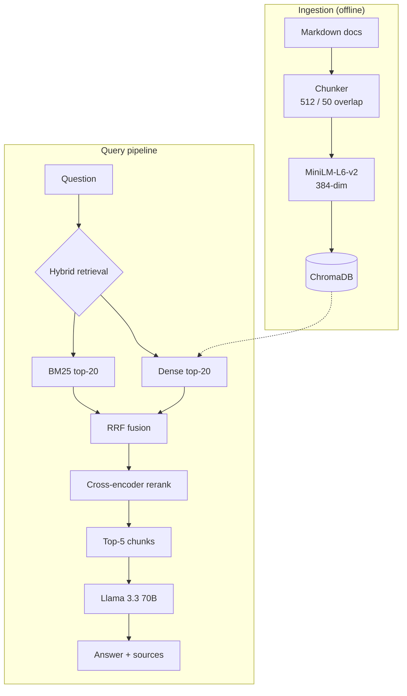

# RAG Customer Support Assistant


> Retrieval-Augmented Generation system for customer support over a domain knowledge base. Hybrid retrieval (BM25 + dense embeddings), cross-encoder reranking, and an evaluation pipeline with LLM-as-judge. Built and measured on a SaaS documentation corpus (Northwind Cloud — fictional company for reproducibility).

---

## Highlights

- **Real measured evaluation**: 30-question test set, **Recall@5 = 96.7%**, **Correctness = 93.7%**, **Faithfulness = 98.3%** (LLM-as-judge), avg total latency **1.9 s**
- **Production architecture**: hybrid retrieval (BM25 + dense) → cross-encoder rerank → calibrated generation
- **Ablation study**: vector-only vs hybrid vs hybrid+rerank — recall and latency trade-offs documented
- **End-to-end runnable**: `python demo.py "your question"` works after a single ingestion command
- **REST API** (FastAPI) + **CLI** entry points
- Unit tests passing in CI

---

## Quick Results


Per-category breakdown across 12 question types:


---

## Architecture



---

## Stack

| Layer | Tool / Model |
|---|---|
| **LLM** | Llama 3.3 70B via [Groq](https://groq.com) (primary), Gemini 2.0 Flash (fallback) |
| **Embeddings** | `sentence-transformers/all-MiniLM-L6-v2` (384-dim) |
| **Vector DB** | [ChromaDB](https://www.trychroma.com/) (persistent, cosine similarity) |
| **Lexical retrieval** | BM25 (`rank-bm25`) |
| **Reranker** | `cross-encoder/ms-marco-MiniLM-L-6-v2` |
| **Chunking** | `langchain-text-splitters` RecursiveCharacterTextSplitter |
| **Agent** | [LangGraph](https://langchain-ai.github.io/langgraph/) (graph + tools — backend) |
| **API** | FastAPI + Uvicorn |
| **Eval** | Custom retrieval + LLM-as-judge pipeline |
| **Testing** | pytest |

---

## Evaluation

**Test set** — 30 questions across 12 categories with ground-truth answers and expected sources.

**Metrics**
- **Recall@5** — expected source in top-5 retrieved chunks
- **Correctness** (0–1) — LLM-as-judge against ground truth
- **Faithfulness** (0–1) — every claim supported by retrieved context
- **Latency** — end-to-end question → answer

Reproducible: `python -m src.evaluation.evaluate full` · test set: `data/eval/test_set.json`.

### Ablation


| Configuration | Recall@5 | Latency |
|---|---:|---:|
| Vector only | **100.0%** | 8 ms |
| + BM25 hybrid (RRF) | 96.7% | 7 ms |
| + Cross-encoder rerank | 96.7% | 314 ms |

On a clean 100-chunk corpus dense search alone is enough. Hybrid + rerank pay off on larger, noisier production corpora — exact product names, error codes, versions — so the full stack is kept as production reference.

---

## Quick Start

```bash
# 1. Install
pip install -r requirements.txt

# 2. Set GROQ_API_KEY (free tier at https://console.groq.com)
cp .env.example .env
# edit .env to add your key

# 3. Build the knowledge base (loads markdown → chunks → ChromaDB)
python -m src.ingestion.build_knowledge_base

# 4. Ask a question
python demo.py "How much does the Business plan cost?"
```

### REST API

```bash
uvicorn src.api.main:app --port 8000
```

```bash
curl -X POST http://localhost:8000/chat \
  -H "Content-Type: application/json" \
  -d '{"query": "What payment methods do you accept?"}'
```

### Docker

```bash
docker-compose up
```

Builds the image, runs ingestion at build-time, and exposes the API on `:8000` with a health-check.

---

<details>
<summary><b>Project Structure</b></summary>

```
.
├── demo.py                          # CLI entry point
├── data/
│   ├── raw/                         # 14 markdown documents (synthetic SaaS docs)
│   ├── eval/test_set.json           # 30-question test set with ground truths
│   └── chroma_db/                   # built locally, gitignored
├── src/
│   ├── audit/                       # structured logging + PII canary
│   ├── auth/                        # UserContext + classification ACLs
│   ├── cache/                       # PII-aware response cache
│   ├── ingestion/                   # chunker + ChromaDB embedder
│   ├── privacy/                     # PII shield (Presidio + UK) + GDPR endpoints
│   ├── retrieval/                   # hybrid + rerank + RAG pipeline
│   ├── security/                    # prompt-injection defense
│   ├── evaluation/                  # retrieval / ablation / full / adversarial / gate
│   └── api/                         # FastAPI service (rate-limited, /metrics)
├── notebooks/
│   └── 01_retrieval_walkthrough.ipynb  # walk-through of vector / BM25 / hybrid / rerank
├── tests/                           # 12 unit tests
└── assets/                          # generated charts for this README
```

</details>

## License

MIT
