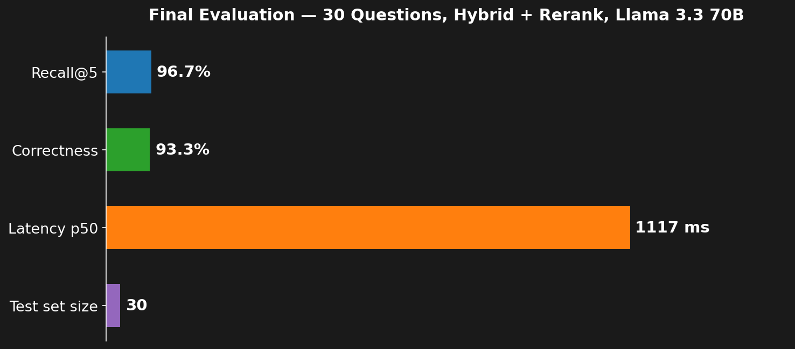
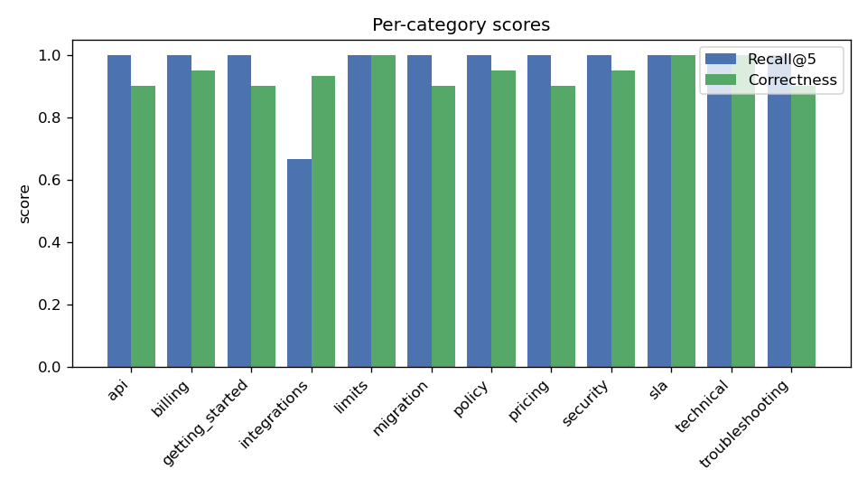
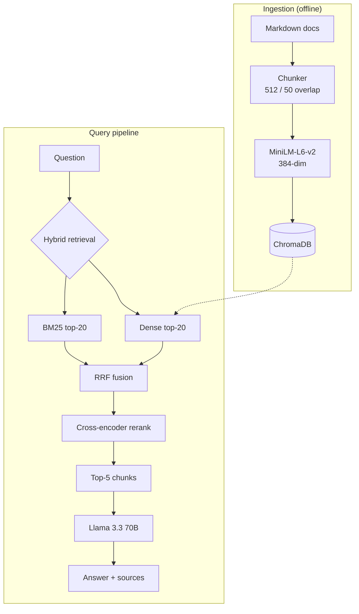
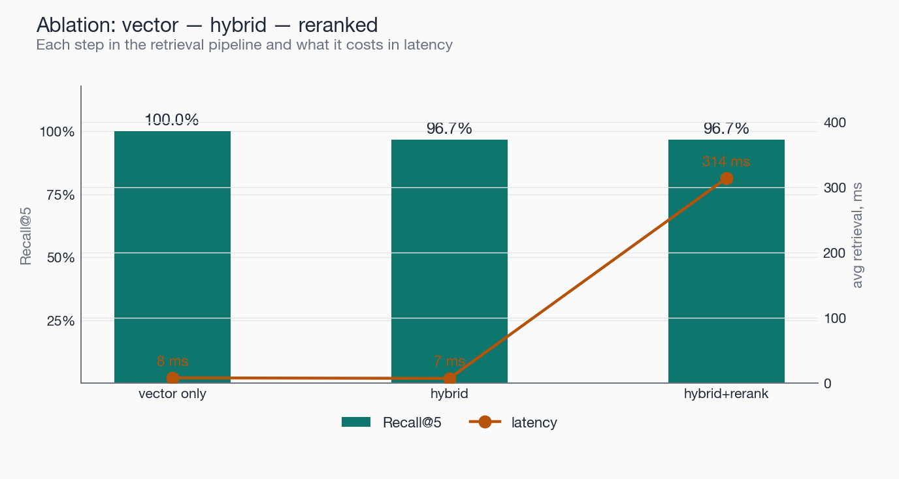

# RAG Customer Support Assistant


> Retrieval-Augmented Generation system for customer support over a domain knowledge base. Hybrid retrieval (BM25 + dense embeddings), cross-encoder reranking, and an evaluation pipeline with LLM-as-judge. Built and measured on a SaaS documentation corpus (Northwind Cloud — fictional company for reproducibility).

---

## Highlights

- **Agentic layer (v2)**: explicit LangGraph StateGraph — input/output guardrails as graph nodes, structured-output router, CRAG self-corrective retrieval, runtime groundedness check (Self-RAG lite), semantic cache
- **Real measured evaluation**: 30-question test set, **Recall@5 = 96.7%**, **Correctness = 93.7%**, **Faithfulness = 98.3%** (LLM-as-judge), avg total latency **1.9 s**
- **Production architecture**: hybrid retrieval (BM25 + dense) → cross-encoder rerank → calibrated generation
- **Ablation study**: vector-only vs hybrid vs hybrid+rerank — recall and latency trade-offs documented
- **End-to-end runnable**: `python demo.py "your question"` works after a single ingestion command
- **REST API** (FastAPI) + **CLI** entry points
- Unit tests passing in CI

---

## Quick Results



Per-category breakdown across 12 question types:



---

## Architecture


```mermaid
flowchart TB
    subgraph ingest["Ingestion (offline)"]
        A1[Markdown docs] --> A2["Chunker<br/>512 / 50 overlap"]
        A2 --> A3["MiniLM-L6-v2<br/>384-dim"]
        A3 --> A4[(ChromaDB)]
    end

    subgraph query["Query pipeline"]
        B1[Question] --> B2{Hybrid retrieval}
        B2 --> B3[Dense top-20]
        B2 --> B4[BM25 top-20]
        B3 --> B5[RRF fusion]
        B4 --> B5
        B5 --> B6[Cross-encoder rerank]
        B6 --> B7[Top-5 chunks]
        B7 --> B8[Llama 3.3 70B]
        B8 --> B9[Answer + sources]
    end

    A4 -.-> B3
```


### Agentic layer (v2) — explicit LangGraph StateGraph

```
START
  |
guard_input --(injection / PII / empty)--> refuse --> END        <- deterministic, no LLM
  | ok
classify  <- structured output (Pydantic): intent + confidence
  |
  |-- chitchat  --> template reply --> END                       <- no LLM
  |-- offtopic  --> polite refusal --> END                       <- no LLM
  |-- complaint --> escalate to human --> END                    <- no LLM
  |-- product question
        |
      agent <-> tools        <- ReAct loop: search_knowledge (CRAG inside)
        |
      guard_output --(violations)--> repair (structured output) --> END
        | clean
      check_grounded --(unsupported facts)--> strict_regen --> END   <- Self-RAG lite
        | grounded
       END
```

Design principles (each is a deliberate trade-off, not an accident):

- **Guardrails are graph nodes, not prompt text** — prompt injection and PII are
  screened by deterministic functions *before* the first LLM call and cannot be
  bypassed by prompting; output guards catch discount offers, unbacked SLA
  promises and leaked tool-call markup.
- **Escalation and refusals are deterministic branches** — no LLM call, no
  hallucination risk, near-zero latency on these paths.
- **Structured outputs everywhere** (Pydantic): intent router, CRAG context
  grader, answer repair, groundedness verdict.
- **CRAG** (Yan et al., 2024): retrieved top-3 is graded by a small LLM; weak
  context triggers a query rewrite and a second retrieval pass. Fails open.
- **Groundedness check** (Self-RAG lite): a judge verifies the final answer
  against retrieved context; unsupported answers are regenerated in strict
  "context-only" mode.
- **Semantic cache**: paraphrases of typical questions are served from an
  embedding cache (threshold 0.88, calibrated on paraphrase vs
  different-question similarity data); only clean, non-escalated answers are
  ever cached.
- **Dialogue memory** per `session_id` via LangGraph checkpointer.

Endpoints: `POST /agent/chat` (agentic, with memory and cache),
`POST /chat` (linear RAG baseline kept for comparison), `GET /agent/cache/stats`.

---

## Stack

| Layer | Tool / Model |
|---|---|
| **LLM** | Llama 3.3 70B via [Groq](https://groq.com) (primary), Gemini 2.0 Flash (fallback) |
| **Embeddings** | `sentence-transformers/all-MiniLM-L6-v2` (384-dim) |
| **Vector DB** | [ChromaDB](https://www.trychroma.com/) (persistent, cosine similarity) |
| **Lexical retrieval** | BM25 (`rank-bm25`) |
| **Reranker** | `cross-encoder/ms-marco-MiniLM-L-6-v2` |
| **Chunking** | `langchain-text-splitters` RecursiveCharacterTextSplitter |
| **Agent** | [LangGraph](https://langchain-ai.github.io/langgraph/) explicit StateGraph: guard nodes, structured-output router, CRAG, groundedness check, semantic cache |
| **API** | FastAPI + Uvicorn |
| **Eval** | Custom retrieval + LLM-as-judge pipeline |
| **Testing** | pytest |

---

## Evaluation

**Test set** — 30 questions across 12 categories with ground-truth answers and expected sources.

**Metrics**
- **Recall@5** — expected source in top-5 retrieved chunks
- **Correctness** (0–1) — LLM-as-judge against ground truth
- **Faithfulness** (0–1) — every claim supported by retrieved context
- **Latency** — end-to-end question → answer

Reproducible: `python -m src.evaluation.evaluate full` · test set: `data/eval/test_set.json`.

### Ablation



| Configuration | Recall@5 | Latency |
|---|---:|---:|
| Vector only | **100.0%** | 8 ms |
| + BM25 hybrid (RRF) | 96.7% | 7 ms |
| + Cross-encoder rerank | 96.7% | 314 ms |

On a clean 100-chunk corpus dense search alone is enough. Hybrid + rerank pay off on larger, noisier production corpora — exact product names, error codes, versions — so the full stack is kept as production reference.

---


## Testing (a pyramid for LLM systems)

```bash
pytest                       # fast suite, no LLM calls, no network
```

| Level | What | Why |
|---|---|---|
| Unit | guards, chunker, caches, RBAC — pure functions | logic regressions |
| Red-team | parametrized prompt-injection + PII attacks | security is tested, not assumed |
| Structure | graph nodes/edges: every request provably enters `guard_input` first | architecture contracts |
| Mocked | semantic cache with injected toy embedder; CRAG grading paths | expensive branches, deterministically |
| Contract | FastAPI schemas, validation, rate limits | client-facing API stability |
| Offline eval | retrieval metrics + LLM-as-judge on the golden set | quality drift between releases |

LLM-calling tests and judge-based evaluation are run on a schedule, not on every
commit — they cost tokens and hit rate limits; the fast suite stays free and instant.

---
## Quick Start

```bash
# 1. Install
pip install -r requirements.txt

# 2. Set GROQ_API_KEY (free tier at https://console.groq.com)
cp .env.example .env
# edit .env to add your key

# 3. Build the knowledge base (loads markdown → chunks → ChromaDB)
python -m src.ingestion.build_knowledge_base

# 4. Ask a question
python demo.py "How much does the Business plan cost?"
```

### REST API

```bash
uvicorn src.api.main:app --port 8000
```

```bash
curl -X POST http://localhost:8000/chat \
  -H "Content-Type: application/json" \
  -d '{"query": "What payment methods do you accept?"}'
```

### Docker

```bash
docker-compose up
```

Builds the image, runs ingestion at build-time, and exposes the API on `:8000` with a health-check.

---

<details>
<summary><b>Project Structure</b></summary>

```
.
├── demo.py                          # CLI entry point
├── data/
│   ├── raw/                         # 14 markdown documents (synthetic SaaS docs)
│   ├── eval/test_set.json           # 30-question test set with ground truths
│   └── chroma_db/                   # built locally, gitignored
├── src/
│   ├── audit/                       # structured logging + PII canary
│   ├── auth/                        # UserContext + classification ACLs
│   ├── cache/                       # PII-aware response cache
│   ├── ingestion/                   # chunker + ChromaDB embedder
│   ├── privacy/                     # PII shield (Presidio + UK) + GDPR endpoints
│   ├── agent/                       # LangGraph StateGraph, guards, structured outputs
│   ├── retrieval/                   # hybrid + rerank + corrective (CRAG) + RAG pipeline
│   ├── security/                    # prompt-injection defense
│   ├── evaluation/                  # retrieval / ablation / full / adversarial / gate
│   └── api/                         # FastAPI service (rate-limited, /metrics)
├── notebooks/
│   └── 01_retrieval_walkthrough.ipynb  # walk-through of vector / BM25 / hybrid / rerank
├── tests/                           # 100+ tests: unit, red-team, graph structure, contract
└── assets/                          # generated charts for this README
```

</details>

## License

MIT
